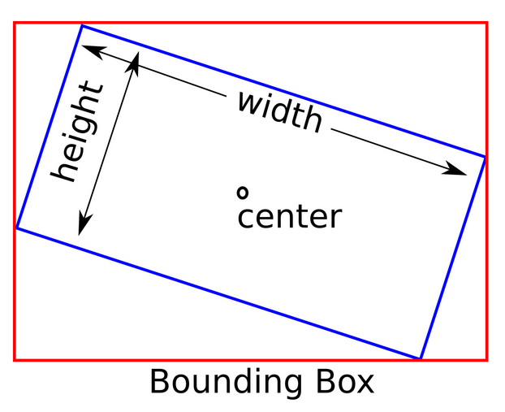
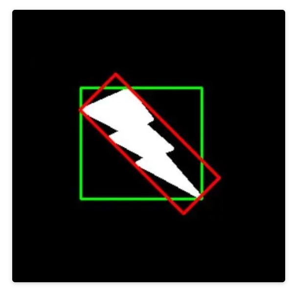
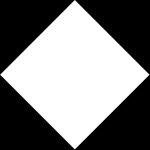

# Real-time 2-D Object Recognition
This project is about 2D object recognition. The goal is to have the computer identify a specified set of objects placed on a white surface in a translation, scale, and rotation invariant manner from a camera looking straight down. The computer should be able to recognize single objects placed in the image and identify the object an output image.

# Instruction for running the executables
1. The executable takes two input. The first is the path to the csv file store the class name and feature vector for each known object.
2. The second is the classifier type ('n' for the nearest neighbor, 'k' for KNN).
   - example: './objectRecognizer objectDB.csv n'
3. Enter training mode: type 't'. The system will switch back to inference mode after labeling all the objects in the video

4. Code for the classname (used in training mode)
    Since this system is designed to recognize a specific set of objects(the 14 objects listed), to make the training mode
    easier to operate, it will ask the user to type a code(one letter) on the video window instead of typing the full name in the terminal.
    Here is the code to classname map:
    {'p', "pen"},   {'c', "cell_phone"}, {'n', "notebook"},   {'g', "glasses"},
    {'a', "apple"}, {'h', "hat"},        {'b', "bottle"},     {'k', "key"},
    {'m', "mouse"}, {'x', "wire"},
    {'w', "watch"}, {'s', "speaker"},    {'t', "TV_Screen"} , {'l', "lamp"}

## Task 1 - Threshold the input video
The task is to implement a thresholding algorithm for a video to separate objects from the background. The goal is to create an object recognition system by applying the thresholding algorithm to each frame of the video. The algorithm should be able to identify and display the thresholded video, where the objects appear as distinct from the background.

To improve the accuracy of the thresholding, some pre-processing techniques can be applied. These include blurring the image to make regions more uniform and adjusting the intensity of strongly colored pixels to differentiate them from the background. The objects used in the video should be darker than the background, and the overall lighting conditions should be well-lit for better visibility.

- threshold(Mat &image) This function converts an image to grayscale and then applies a thresholding operation. It sets any pixel with a value less than or equal to 130 as foreground (white), and other pixels as background (black). The function returns the thresholded image as a grayscale Mat.

## Task 2 - Cleanup the binary image
The task is to improve the quality of the thresholded binary image by applying morphological filtering. This filtering technique helps in addressing issues such as noise, holes, or other imperfections in the image. The goal is to choose a strategy, either growing or shrinking the image regions, to enhance the image quality.

Morphological filters basically modifies the shape and structure of the image using mathematical operations like dilation and erosion. 
1. Dilation expands or grows the regions in an image, while 
2. erosion shrinks or reduces them. 
By selecting an appropriate strategy, we can effectively remove noise or fill holes in the thresholded image.

- cleanup(Mat &image): This function performs image cleanup by applying dilation followed by erosion. It helps to remove small noise and smooth the binary image. The function uses a predefined kernel for the morphological operations and returns the cleaned up image as a Mat.

## Task 3 - Segment the image into regions
The task is to implement connected components analysis on a thresholded and cleaned image to segment it into regions. 
The connected components analysis algorithm identifies distinct regions in an image by grouping together pixels that are connected or adjacent to each other. The system should be able to display the regions it finds, preferably with each region represented in a different color.

Additionally, the system should have the ability to ignore small regions and limit the recognition to the largest N regions if desired. The OpenCV library provides a connected components function that can be used for this purpose, which also returns statistics about the regions.

- getRegions(Mat &image, Mat &labeledRegions, Mat &stats, Mat &centroids, vector<int> &topNLabels): This function extracts the largest three regions from a given image. It uses the connected component labeling algorithm to label each pixel in the image with a unique region label. The function then calculates the area of each labeled region and selects the largest three regions that meet a certain area threshold. The function returns an image where each region is colored with a random color and updates the topNLabels vector with the labels of the largest regions.

## Task 4 - Compute features for each major region
The task is to implement a function that computes a set of features for a specific region in an image. The function takes a region map and a region ID as input. The goal is to calculate features that are invariant to translation, scale, and rotation, such as moments around the central axis of rotation.

One of the features that should be computed is the axis of the least central moment, which represents the direction of the region's elongation. 
Another feature is the oriented bounding box, which is the minimum bounding rectangle that encloses the region and is aligned with the region's orientation.
OpenCV provides a function for computing moments, which will be used to calculate the features. 

### RotatedRect object type
The last useful class is a particular rectangle called RotatedRect. This class represents a rotated rectangle specified by a center point, the width and height of a rectangle, and the rotation angle in degrees:

'''
cv::RotatedRect::RotatedRect(const Point2f &center, const Size2f &size,float angle)**
Parameters
center :- The rectangle mass center
size :- Width and height of the rectangle
angle :- The rotation angle in a clockwise direction. When the angle is 0, 90, 180, 270 etc., the rectangle becomes an up-right rectangle
'''

An interesting function of this class is boundingBox. This function returns Rect, which contains the rotated rectangle:

### Minimum Area Rectangle
The bounding rectangle is drawn with a minimum area. Because of this, rotation is also considered. The below image shows 2 rectangles, the green one is the normal bounding rectangle while the red one is the minimum area rectangle. See how the red rectangle is rotated.

'''
cv::minAreaRect(InputArray points);	
'''

The function calculates and returns the minimum-area bounding rectangle (possibly rotated) for a specified point set.

### What is a Blob ?
Image processing is used to extract different features in an image. To do this, we can perform image processing techniques to single out and detect such features and objects. One of the most promising techniques is called Blob Detection.

A Blob, in a sense, is anything that is considered a large object or anything bright in a dark background. In images, we can generalize it as a group of pixel values that forms a somewhat colony or a large object that is distinguishable from its background. Using image processing, we can detect such blobs in an image.

### What is the centroid of a shape ?
The centroid of a shape is the arithmetic mean (i.e. the average) of all the points in a shape. Suppose a shape consists of n distinct points \mathbf{x_1}... \mathbf{x_n}
centroid is given by

    \[\mathbf{c} = \frac{1}{n} \sum^n_{i=1} \mathbf{x}_i\]

### Image Moments
We can find the center of the blob using * **moments()** in OpenCV. But first of all, we should know what exactly Image moment is all about. In computer vision and image processing, image moments are often used to characterize the shape of an object in an image. These moments capture basic information such as the area of the object, the centroid (i.e. the center (x, y)-coordinates of the object), the orientation, and other desirable properties. 
Image Moment is a particular weighted average of image pixel intensities, with the help of which we can find some specific properties of an image, like radius, area, centroid etc. To find the centroid of the image, we generally convert it to binary format and then find its center.

The centroid is given by the formula:-

    \[C_x = \cfrac{M_{10}}{M_{00}}\]

    \[C_y = \cfrac{M_{01}}{M_{00}}\]

C_x is the x coordinate and C_y is the y coordinate of the centroid and M denotes the Moment.

'''
cv::moments(InputArray array, bool binaryImage = false);
'''

### Steps for finding Centroid of a Blob in OpenCV
To find the center of the blob, we will perform the following steps:-
1. Convert the Image to grayscale.
2. Perform Binarization on the Image.
3. Find the center of the image after calculating the moments.

### Center of multiple blobs in an Image
Finding the center in case of multiple blobs, we use the function * **findContours()**,to find the number of contours in the Image and find the center of each of them, where the contour is the list of all the contours present in the image.

'''
void cv::findContours(InputOutputArray image,
		OutputArrayOfArrays contours,
		OutputArray hierarchy,
		int mode,
		int method,
		Point offset = Point())
'''

### What are Hu Moments?
It is great that central moments are translation invariant. But that is not enough for shape matching. We would like to calculate moments that are invariant to translation, scale, and rotation.
Fortunately, we can in fact calculate such moments and they are called Hu Moments.
Hu Moments (or rather Hu moment invariants) are a set of 7 numbers calculated using central moments that are invariant to image transformations. The first 6 moments have been proved to be invariant to translation, scale, and rotation, and reflection. While the 7th moment’s sign changes for image reflection.

The most notable are * **HuMoments()** which can be used to describe, characterize, and quantify the shape of an object in an image.

Hu Moments are normally extracted from the silhouette or outline of an object in an image. By describing the silhouette or outline of an object, we are able to extract a shape feature vector (i.e. a list of numbers) to represent the shape of the object.

We can then compare two feature vectors using a similarity metric or distance function to determine how “similar” the shapes are.

### How to find Outline of an image / How to calculate Hu Moments in OpenCV?
Normally, we obtain the shape after applying some sort of segmentation (i.e. setting the background pixels to black and the foreground pixels to white). Thresholding is the most common approach to obtain our segmentation. After we have performed thresholding we have the silhouette of the object in the image. We could also find the contours of the silhouette and draw them, thus creating an outline of the object.

Regardless of which method we choose, we can still apply the HuMoments shape descriptors provided that we obtain consistent representations across all images.

This image is of a diamond, where the black pixels correspond to the background of the image and the white pixels correspond to the foreground. This is an example of a silhouette of an object in an image. If we had just the border of the diamond, it would be the outline of the object.

Regardless, it is important to note that our HuMoments shape descriptor will only be computed over the white pixels.

1. import opencv2 package which provides us with our OpenCV bindings.
2. load the diamond image off disk using the cv::imread() method and convert it to grayscale.
3. We convert our image to grayscale because HuMoments requires a single channel image — the shape quantification is only carried out among the white pixels.
4. In order to compute HuMoments, first compute the original * **24 moments** associated with the image using cv::moments()
5. Pass these moments into cv::HuMoments(), which calculates Hu’s * **7 invariant moments**
6. Finally, flatten the array to form the shape feature vector.

This feature vector can be used to quantify and represent the shape of an object in an image.

'''
// convert input image to grayscale
cv::Mat im = imread(filename, IMREAD_GRAYSCALE);
// Threshold image
threshold(im, im, 128, 255, THRESH_BINARY);
// Calculate Moments 
cv::Moments imageMoments = cv::moments(im, false);
// Calculate Hu Moments 
double huMoments[7];
cv::HuMoments(imageMoments, huMoments);
// Log scale hu moments 
for(int i = 0; i < 7; i++) {
    huMoments[i] = -1 * copysign(1.0, huMoments[i]) * log10(abs(huMoments[i])); 
}
//Shape Matching
double d1 = matchShapes(im1, im2, CONTOURS_MATCH_I1, 0); 
double d2 = matchShapes(im1, im2, CONTOURS_MATCH_I2, 0); 
double d3 = matchShapes(im1, im2, CONTOURS_MATCH_I3, 0);
'''

- getBoundingBox(Mat &region, double x, double y, double alpha): This function calculates the rotated bounding box of a given region. It takes the region image, centroid coordinates, and the angle of rotation as input and returns a rotated rectangle (RotatedRect) that tightly encloses the region.

- drawLine(Mat &image, double x, double y, double alpha, Scalar color): This function draws a line on the given image starting from the specified coordinates (x, y) and with the specified angle (alpha). The line has a length of 100 pixels and is drawn with the specified color.

- drawBoundingBox(Mat &image, RotatedRect boundingBox, Scalar color): This function draws a rotated bounding box on the given image. It takes a RotatedRect object representing the bounding box and a color as input and draws the box on the image.

- calcHuMoments(Moments mo, vector<double> &huMoments): This function calculates the Hu Moments from the given central moments. It takes a Moments object containing the central moments and updates the huMoments vector with the seven attributes of Hu Moments.

- euclideanDistance(vector<double> features1, vector<double> features2): This function calculates the normalized Euclidean distance between two vectors. It takes two feature vectors as input and returns the normalized distance as a double value.

# Task 5 - Collect training data
The task is to modify the system to have a training mode where it can collect feature vectors from objects, associate them with labels or names, and store them in a database (e.g., a file). This mode allows the user to gather feature vectors of known objects and save them for future use in classifying unknown objects.

To implement this, user can introduce a key press trigger, such as when the user types a specific key (e.g., 'T'). When this key is pressed, the system will prompt the user to enter a name or label for the current object. It will then capture the feature vector of the object and store it in a file along with the corresponding label.

This training mode can be used to collect feature vectors either by directly capturing them from objects or by using labeled still images of the objects, such as those from a training set. The collected data can later be used to train the system and improve its ability to classify unknown objects based on their feature vectors.

If the system is in training mode:
1. The current region (object) is displayed in a separate window in binary form.
2. The user is prompted to input a class name (label) for the object.
3. The system waits for a keypress and maps it to a class name using a predefined mapping function.
4. The feature vector of the object (in this case, huMoments) is added to a features database (featuresDB), and the corresponding class name is added to a class names database (classNamesDB).
5. If all objects have been labeled, the system switches back to inference mode, destroys the training mode window, and displays a message indicating that it is in inference mode.
Otherwise, if there are more objects to label:
6. The system enters the inference mode.
7. The object (region) is classified using a classification function (classifier or classifierKNN depending on the specified command line argument).
8. The classified class name is overlaid onto the video frame at the position of the object's centroid.

# Task 6 - Classify new images
The task is to enhance the system's capability to classify new feature vectors using a known objects database. This classification process involves using a scaled Euclidean distance metric, such as (x1 - x2) / stdev_x, although other distance metrics can also be experimented with.

Here's a simplified explanation of the task:
1. The system will receive a new feature vector representing an unknown object.
2. The feature vector will be compared to the feature vectors stored in the objects database.
3. The comparison will be based on a distance metric, where the Euclidean distance between the feature vectors will be scaled by dividing it by the standard deviation of the feature vectors in the database.
4. The system will determine the closest matching feature vector in the database by finding the smallest distance.
5. The label of the closest matching feature vector will be assigned to the unknown object, indicating its classification.
6. The system will then indicate the label of the object on the output video stream, typically by overlaying the label onto the video feed.

- classifier(vector<vector<double>> featureVectors, vector<string> classNames, vector<double> currentFeature): This function performs object classification based on the nearest neighbor approach using normalized Euclidean distance. It takes a vector of known feature vectors, a vector of corresponding class names, and the feature vector of the object to be classified. The function returns the inferred class name for the given feature vector.

# Task 7 - KNN Classifier
- classifierKNN(vector<vector<double>> featureVectors, vector<string> classNames, vector<double> currentFeature, int K): This function performs object classification based on the K-Nearest Neighbor (KNN) approach using normalized Euclidean distance. It takes a vector of known feature vectors, a vector of corresponding class names, the feature vector of the object to be classified, and the value of K. The function returns the inferred class name for the given feature vector.

# Task 8 - Evaluate the performance of your system
The task requires evaluating the performance of the system on multiple images of each object and creating a confusion matrix to compare the true labels of the objects with the labels assigned by the system. The confusion matrix provides a summary of the classification results, showing the number of correct and incorrect classifications for each class.

Here's an overview of the task:
1. Gather a set of images for each object that you want to evaluate. Ensure that you have at least two images per object.
2. Run the classification system on each image and obtain the predicted class labels.
3. Compare the predicted labels with the true labels of the objects.
4. Build a confusion matrix to summarize the classification results. The confusion matrix is a table that shows the counts of true positives, false positives, true negatives, and false negatives for each class.
5. Print the confusion matrix in CSV format, which makes it easier to copy and paste into a report or spreadsheet.

- getClassName(char c): This function maps a character code to a corresponding class name. It returns the class name as a string based on the provided

References:
- https://www.oreilly.com/library/view/building-computer-vision/9781838644673/edc7c054-854a-4f58-b1e8-bb02213cceb8.xhtml
- https://learnopencv.com/find-center-of-blob-centroid-using-opencv-cpp-python/
- https://docs.opencv.org/2.4/modules/imgproc/doc/structural_analysis_and_shape_descriptors.html?highlight=moment#cv2.HuMoments
- https://towardsdatascience.com/image-processing-blob-detection-204dc6428dd
- https://pyimagesearch.com/2014/10/27/opencv-shape-descriptor-hu-moments-example/
- https://theailearner.com/tag/cv2-minarearect/
- https://learnopencv.com/shape-matching-using-hu-moments-c-python/

